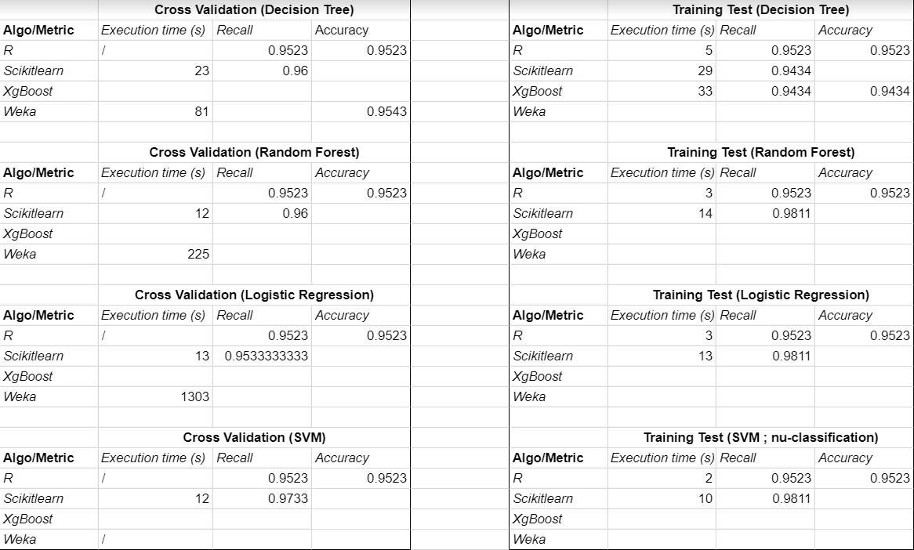

# MML-classification
## multi machine learning language (for classification) 

###Introduction

**Datasets**
We used the iris dataset, the variable to predict beeing the flower variety (Setosa, Versicolor or Virginica) using sepal length & width and petal length & width.

**Implemented compilers**
+ Scikitlearn : A free Python library for machine learning.
+ R : A programming language and open source software for statistics and data science. 
+ Weka : A suite of machine learning software written in Java.
+ XgBoost : An open source software library for implementing Gradient boosting methods in R, Python and Julia.

###Results

### Answers to the requested questions

**On your datasets, which framework + algorithm is best ranked (compared to other frameworks) in terms of :**
+ Execution time : R is taking from 6 to 15 seconds (depending on the algorithm) to process iris.csv dataset. Weka is a bit slower, and Scikitlearn is the fastest.
+ Recall : R algorithms have a recall of 0.95. Weka : ... and Scikitlearn : 0.98

**Among machine learning frameworks and algorithms, are some implementations significantly slower/precise than others ?**
+ Sickit-learn seems more precise, with a recall at 98 percent

**Given a machine learning algorithm (e.g., decision tree), do we observe differences (execution time/precision) between frameworks?**
* Decision Tree: 
	* R execution time (Training test) = 5s, recall = 0.9523, precision = 0.9583;
	* Weka execution time (Cross validation) = 81s, recall = 0.9533, precision = 0.9543; 
* Random Forest: 
	* R execution time (Training test) = 3s, recall = 0.9523, precision = 0.9583;
	* Weka execution time (Cross validation) = 225s, recall = 0.9466, precision =0.9471 ; 
* Logistic Regression:
	* R execution time (Training test) = 3s, recall = 0.9523, precision = 0.9583;
	* Weka execution time (Cross validation) = 1303s, recall = 0.8466, precision = 0.8481; 
* SVM (gamma=3.2 Cost=1.0 nu-classification):
	* R execution time (Training test) = 2s, recall = 0.9523, precision = 0.9583;
	* Weka execution time (Cross validation) = , recall = , precision = ; 

**Are there more difficult datasets to process in terms of:**
+ Recall? ...
+ Execution time ? : .....

**In light of the results, which machine learning framework do you recommend?**
R and Python both have great communities providing documentation & libraries, whereas few documentation was found about Weka.
Globally, Weka is taking way more time than others frameworks to process the dataset for similar results.
About the results, ...

### Required configuration

**R :**
+ add C:\Program Files\R\R-3.6.2\bin\x64 (or equivalent) to your PATH
+ add options(repos = "https://cran.r-project.org/",menu.graphics = FALSE) to your RProfile configuration file.
+ you may need to launch Eclipse with privileges in order to install R libraries correctly.

**Scikitlearn :**
+ In ScikitLearnCompilateur.java, replace python.exe's path by your own.

**XgBoost :**
+ In XgboostCompilateur.java, replace python.exe's path by your own.

**Weka :**
+ In org.xtext.example.mml.tests, add weka-3.7.jar as an external library. (Download link : http://www.java2s.com/Code/Jar/w/Downloadweka370jar.htm)

### Problems encountered
+ No SVM & Training Test implementations was found for Weka.
+ Only precision & recall metrics were retrievable from Weka.
+ We were unable to fetch and write XgBoost's metrics to a CSV file.
+ We have to install R libraries a the beginning of each execution.
+ CrossValidation with R only works when the file is executed in RStudio, not when executed using RScript.
+ Weka won't create a model for Logistic Regression with iris dataset beacause it is too small.
+ R's recall & precision are the same, regardless of the algorithm used.
+ Training test using XGBoost (xgb) can be done using the DMatrix function for each set but the 
  function needs a label after the train_test_split which always returned an error. We apparently can also use the function dump_svmlight_file that from sklearn.datasets to "prepare" data for the XGBoost DMatrix() but that always returned a path error followed by a label error regardless off the num_class (class number hyperparameter) entered. This is why we use the predict sklearn function on the xgb algorithm to predict values and then apply metrics on it.
+ XGBRegressor can be used to make a LogisticRegression, but the only metrics we can 
  get from the data returned by the predict function is "score" which uses the default estimator's scoring method available. We have not been able to return the other eval_metrics using XGBRegressor.
