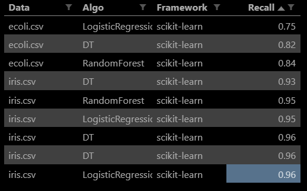

# MML Classification

## Teamates

- Abbah Anoh
- Michael Wolou
- Sylla Mohamadou
- Miguel Rivas

### Q1: Ranking

### Q2

We used two other datasets (ecoli and breast-cancer) to test our solution. We could find them in the root of tests package (org.xtext.example.mydsl.tests).

### Execution

Run MMLFileParsingTest test file in package groupWolouAnoh to execute our Sckit-Learn compiler.

a) By referring to the results generated by our SciKitLearn compiler, we can deduce from the different algorithms tested on the data sets, the DT algorithm seems to have the best accuracy score. We cannot comment on the other frameworks because we unfortunately did not implement a compiler for them.

e) We recommand the Scikit-learn framework, because it is very rich. It offers many classification algorithms. And also, because it is the only one that we know.
