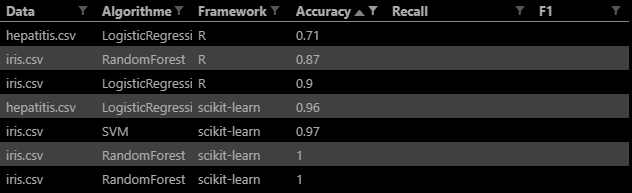

# MML Report

## Group composition
Our group includes Adrien WACQUET, Vadim KUPRATSEVITCH and Kénan LETHIMONIER-HEROUT.

## While testing
You will need to edit mml files to put the correct path of the data set of your device.

## Questions

### Q1
As we were only 3, we didn't have the time to implement every requested compiler.  
We only implemented the Python (scikit-learn), the R (too many different librairies) and the Java-Weka

Just by looking at this table, we can suggest that Python seems to be more powerful **for the small size data sets** that we used. As a matter of fact, Scikit-learn is more accurate than R on all tested algorithm which outputs accuracy. It also appears that RandomForest performs perfectly for Scikit-learn, but the other algorithms are close behind.  
Lastly, we didn't output enough results in other metrics to use them for a comparison.

### Q2
We used these data sets in order to test our solution : 
 * iris.csv → the goal is to be able to determine the flower class between 3 classes
    * Setosa ;
    * Versicolor ;
    * Virginica
 * vehicle.csv → the goal is to be able to determine the vehicle between 4 classes
    * Van ;
    * Bus ;
    * Saab ;
    * Opel
 * hepatitis.csv → the goal is to be able to tell if the person with the given diseases is dead or alive

All those files are in our resources folder.

### Q3
As it wasn't the same developer who implemented both languages, we didn't built it the same way. Differences could come from the fact that we did not use an interface to gather shared resources but it is about the fact that one decided to run the compiled script without installing librairies while the other did.  
Indeed, in Python it is expected that the user would have all the requested librairies prior running the script while in R, the script is running in vanilla mode, i.e. without looking for the user environment to avoid caching data which would fake the whole thing.  
Thus, we did not created a ranking algorithm to find out which one was the fastest between R and Python. Moreover, the data size was not big enough to see a real difference between both languages.  

We have here the same algorithm as we used for **Q1** with the excution time added. As we said above, R installs the needed packages/librairies for each run, that's no surprise it is far behind in execution time.  
Despite the longer execution time, we ran R scripts by ourselves to see if it was the processing that was taking this much time but it turned out that R is incredibly long to install things as it has to try multiple times.  
The algorithm class is the Java class `LanguageRanking`.  

### Q4
1. On our data sets, which framework/algorithm couple is best ranked ?  
    * Execution time :  
    On a runtime basis, Scikit-learn/DecisionTree and Scikit-learn/SVM are identicals, the execution is faster than RandomForest (we only have one case of LogisticRegression which is also close to the first two), which take between 2 or 3 more time.
    * Accuracy / Recall :
    If we compare the same data set between the two frameworks, Scikit-learn/RandomForest (or any other algorithm with the 'Accuracy' metric) is leading as it always has more than 95% accuracy. However the Scikit-learn/SVM's recall is not quite as good as the only R/SVM's recall.
2. Among machine learning frameworks and algorithms, are some implementations significantly slower/precise than others ?
    * Scikit-learn/RandomForest seems to be the slowest algorithm for Scikit-learn. Furthermore, we realize that R/RandomForest is also the slowest algorithm for the same data set.
    * RandomForest seems to be the algorithm that performs well accurately speaking, whatever the framework as it has a solid 100% accuracy.
3. Given a machine learning algorithm (e.g. decision tree), are there differences between the frameworks ?  
For Scikit-learn we do see that RandomForest is the slowest one but it's also the one that performs the best. It is also the onne that had a perfect accuracy on R and it's also one of the slowest. It is safe to assume that both implementations are working the same way.
4. Are there data sets that are more difficult to process ?
It appears that the iris data set is the easiest one to process. It can be explained by the fact that there are few predictors compared to the other two data sets (4 predictors against 18 for vehicle and 19 for hepatitis).
5. Based on the results, which machine learning framework would you recommend ?
While RandomForest is the slowest, it also seems to be the most accurate from all, SVM did some mistakes (by judging its recall and accuracy for R). As machine learning is not something you only use for 10 minutes, it is safe to assume that a slower one would still be used even if DecisionTree can be very good for some cases.
